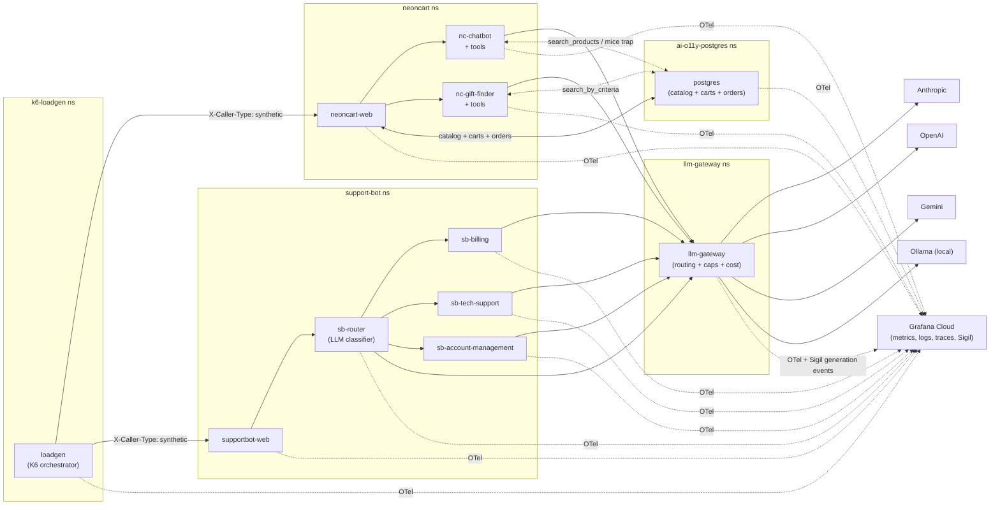

# ai-o11y-demo-apps

> Demo applications for showcasing AI observability with Grafana Cloud.

Two AI-powered applications — a NeonCart e-commerce storefront with an AI gift-finder and chatbot, and a SupportBot internal employee help chat — deploy to any Kubernetes cluster in one step with full OpenTelemetry instrumentation flowing into Grafana Cloud. Every LLM call surfaces in Sigil; tool execution, multi-turn conversations, cost, latency, and a built-in failure trap are all visible end-to-end in the AI Observability plugin.

**Status:** active development

---

## What you get

- A neon-themed e-commerce storefront (NeonCart) backed by a 50-product seed catalog, with an AI chatbot and AI gift-finder
- An internal employee help chatbot (SupportBot / "Ask Acme") with an LLM-driven router that delegates to billing / IT / account specialists
- A central LLM gateway that fronts **Anthropic, OpenAI, Gemini, and Ollama** with per-provider budget caps and weighted-pool model selection (sticky-per-session)
- A K6-driven loadgen producing realistic, varied synthetic traffic across both apps
- A built-in "show me mice" demo trap: a hardcoded path that fires a real Postgres `column does not exist` error visible as a cascading trace
- Full OpenTelemetry telemetry (metrics, logs, traces) + Sigil generation events emitted automatically
- 12 tools across 5 specialists, exercising the full LLM tool-use loop

---

## Architecture



5 namespaces, ~10 pods. Pods emit OTLP directly to the customer's Grafana Cloud (or via their own Alloy if installed).

---

## Quick start

### Prerequisites

1. **Kubernetes cluster** (k3s, EKS, GKE, kind — anywhere `kubectl` works)
2. **Anthropic Claude API key** (`sk-ant-...`) — the only required provider
3. **Grafana Cloud organization with the Sigil plugin enabled** — Sigil owns canonical pricing and the AI o11y UI
4. **`kubectl` and `helm`** on your PATH
5. **Python 3.10+** and the install-script dependencies:
   ```bash
   pip install -r tools/requirements.txt
   ```
   (in a venv if you prefer: `python3 -m venv .venv && source .venv/bin/activate` first)
6. (Optional) OpenAI / Gemini API keys; Ollama URL for local GPU inference

### Install

```bash
git clone https://github.com/stephenwagner-grafana/ai-o11y-demo-apps
cd ai-o11y-demo-apps

# One-shot: prompts for creds, generates configs, runs helm install
./tools/install.sh

# After install:
./tools/verify.sh    # sanity check that every pod is Running
```

Then port-forward to reach the UIs:

```bash
kubectl -n neoncart    port-forward svc/neoncart-web    8080:8000  # http://localhost:8080
kubectl -n support-bot port-forward svc/supportbot-web 8081:8000  # http://localhost:8081
```

### Uninstall

```bash
./tools/uninstall.sh   # helm uninstall + optional PVC + namespace cleanup
```

---

## What to look for after install

| Where | What you'll see |
|---|---|
| **NeonCart UI** (`localhost:8080`) | Browse the cyberpunk storefront. Open the **AI Gift Finder** for personalized recommendations or the **chat widget** for product search. Type *"show me mice"* in the chatbot — the AI will pick the `search_products` tool with a `species=mouse` filter, hit Postgres, and surface the column-doesn't-exist error in the trace. |
| **SupportBot UI** (`localhost:8081`) | Ask a billing/IT/account question. The `sb-router` does an LLM classification call, picks a domain, and delegates. The whole flow shows up as a multi-span trace. |
| **Grafana Cloud → AI Observability plugin** | Sigil's Conversations, Generations, Tools, and Analytics panels populate within a minute. Per-model cost breakdowns, eval results (after configuring evaluators), tool-call sequences. |
| **Grafana Cloud → Tempo** | Full traces from browser → web app → specialist → gateway → provider, including the "show me mice" failure cascade. |
| **Grafana Cloud → Prometheus** | All the app-level + AI counters in `docs/METRICS.md` (`neoncart_revenue_usd_total`, `gen_ai.client.token.usage`, `llm_gateway_provider_open`, etc.). |

---

## Highlighted features

### The "show me mice" trap

Hardcoded into `nc-chatbot`. When the LLM picks the `search_products` tool with a `mice`/`mouse` query, the tool executes a Postgres query against a column that doesn't exist (`species`). The error bubbles through the trace:

```
browser  →  neoncart-web  →  nc-chatbot  →  [tool: search_products]  →  postgres  →  column "species" does not exist
```

This is the signature "tada" moment of the demo. Always on. Type it in the chatbot to see it.

### Weighted model pools (sticky per session)

The LLM gateway randomizes across a configurable pool of models per provider. The shipped Anthropic default mixes six Claude models, biased hard toward cheap/fast Haiku with Opus kept rare (tight rate limits + ~25× the cost of Haiku):

| Model | Weight | Tier |
|---|---|---|
| `claude-haiku-4-5-20251001` | 55% | workhorse |
| `claude-sonnet-4-6` | 23% | latest sonnet |
| `claude-sonnet-4-5` | 12% | older sonnet (label diversity) |
| `claude-opus-4-7` | 5% | latest opus (rare) |
| `claude-opus-4-6` | 3% | older opus (rare) |
| `claude-opus-4-1` | 2% | very rare |

The shipped Ollama default is a 4-model pool covering the practical
parameter-count range you'd see on a single-GPU box (small / medium / large),
with one llama3.1 entry mixed into the qwen2.5 family for vendor diversity on
the model-name label. All four are tool-capable.

| Model | Weight | Tier |
|---|---|---|
| `qwen2.5:3b` | 25% | small (~2GB VRAM, fast feedback) |
| `qwen2.5:7b` | 30% | medium (workhorse) |
| `llama3.1:8b` | 25% | medium (different family — vendor diversity) |
| `qwen2.5:14b` | 20% | large (current default) |

> **Heads-up:** the customer's Ollama server must have all four models pulled
> (`ollama pull qwen2.5:3b`, etc.). The gateway does not auto-pull; a missing
> model surfaces as a 500 from the gateway. If you can't host all four,
> remove the missing entries from `global.modelWeights.ollama`.
>
> Avoid `tinyllama`, `llama3.2:1b|3b`, and `gemma2` — they don't support tool
> calling and produce 400s on tool-using prompts.

Override the pool via `ANTHROPIC_MODEL_WEIGHTS` / `OLLAMA_MODEL_WEIGHTS` in your `.env` (picked up by `tools/install.sh`), or edit `global.modelWeights.<provider>` in your values file:

```yaml
global:
  modelWeights:
    # Format: "model_a:weight_a,model_b:weight_b,..." (weights normalized)
    anthropic: "claude-haiku-4-5-20251001:60,claude-sonnet-4-6:35,claude-opus-4-7:5"
    ollama:    "qwen2.5:3b:25,qwen2.5:7b:30,llama3.1:8b:25,qwen2.5:14b:20"
```

Selection is **sticky per `(session_id, conversation_id)`** so one conversation stays on one model end-to-end (better UX, cleaner per-model dashboard slices).

### Per-provider budget caps + `/open` endpoint

Each provider has a daily budget (Claude defaults to $20/day) or, for Ollama, a GPU utilization threshold. The gateway exposes `GET /open`:

```json
{
  "any_open": true,
  "providers": {
    "anthropic": {"open": true, "spent_usd_today": 5.20, "cap_usd": 20.0},
    "openai":    {"open": false, "reason": "not configured"},
    "ollama":    {"open": true, "gpu_utilization_ratio": 0.42}
  }
}
```

The loadgen polls this every 5s and stops spawning new AI-cohort VUs when Claude is closed — visible as a drop in synthetic traffic on every dashboard.

### Two-tier routing (`X-Caller-Type`)

- **Synthetic traffic** (loadgen sets `X-Caller-Type: synthetic`) → random across configured open providers; respects `/open`; counts against caps
- **Interactive traffic** (no header → real human in a browser) → **always Claude, ungated**

This means a customer demoing the storefront in their browser never gets stuck waiting because loadgen used up Claude's budget — but loadgen still feeds the dashboards 24/7.

### 12 tools across 5 specialists

Specialists ship with proper LLM tool schemas (Anthropic + OpenAI shapes both supported by the gateway):

| Specialist | Tools |
|---|---|
| `nc-chatbot` | `search_products`, `get_product_detail`, `navigate_to_page`, `add_to_cart` |
| `nc-gift-finder` | `search_by_criteria`, `add_to_cart` |
| `sb-billing` | `lookup_employee_expense`, `submit_reimbursement_request` |
| `sb-tech-support` | `search_runbook`, `create_ticket` |
| `sb-account-management` | `lookup_employee_profile`, `request_password_reset` |

The mice trap lives inside `search_products`. All tools call real Postgres queries (where applicable) and emit OTel spans for tool execution.

---

## Project structure

```
.
├── apps/                          One dir per service pod
│   ├── neoncart-web/              Storefront frontend (Python/FastAPI + static cyberpunk UI)
│   ├── neoncart-chatbot/          AI chat specialist (+ "show me mice" trap)
│   ├── neoncart-gift-finder/      AI gift-recommender specialist
│   ├── supportbot-web/            "Ask Acme" frontend
│   ├── supportbot-router/         LLM-driven classifier
│   ├── supportbot-billing/        Expense / corp-card specialist
│   ├── supportbot-tech-support/   IT / runbook specialist
│   └── supportbot-account-management/   IAM / profile specialist
├── gateway/                       LLM Gateway (Anthropic + OpenAI + Gemini + Ollama)
├── postgres/                      Postgres init + seed-loader image
├── loadgen/                       Central K6 orchestrator
├── seed/                          Source-of-truth CSVs (products, categories, brands)
├── helm/                          Helm chart that ties it all together
├── tools/                         install.sh / uninstall.sh / verify.sh / regenerate-users.py / make-packages-public.sh
└── docs/                          METRICS.md, LOADGEN.md, SIGIL_INTEGRATION.md
```

---

## Configuration

The install wizard collects everything; see `docs/SIGIL_INTEGRATION.md` for what each env var does. Key values:

| Required | Purpose |
|---|---|
| `CLAUDE_API_KEY` | Anthropic provider (always required) |
| `SIGIL_ENDPOINT` + `SIGIL_AUTH_TENANT_ID` + `SIGIL_AUTH_TOKEN` | Sigil ingest |
| `OTEL_EXPORTER_OTLP_ENDPOINT` + OTLP instance ID | OTel telemetry → Grafana Cloud |

| Optional | Purpose |
|---|---|
| `OPENAI_API_KEY` / `GEMINI_API_KEY` | Additional cloud providers |
| `OLLAMA_BASE_URL` | Local-GPU provider (e.g. `http://192.168.x.y:11434`) |
| `ANTHROPIC_CAP_USD_PER_DAY` | Default `20` |
| `ANTHROPIC_MODEL_WEIGHTS` / `OLLAMA_MODEL_WEIGHTS` | Weighted model pools |
| `NC_TOTAL_USERS` / `NC_AI_ADOPTION_RATE` / `SB_TOTAL_USERS` | Loadgen sizing |

Full reference: [`helm/values.yaml`](./helm/values.yaml).

---

## Documentation

- [`docs/METRICS.md`](./docs/METRICS.md) — every metric, log field, span attribute, label
- [`docs/LOADGEN.md`](./docs/LOADGEN.md) — synthetic user behaviors, journey weights, throttle response
- [`docs/SIGIL_INTEGRATION.md`](./docs/SIGIL_INTEGRATION.md) — Sigil SDK setup, provider wrappers, workflow steps

---

## License

MIT — see [LICENSE](./LICENSE).
