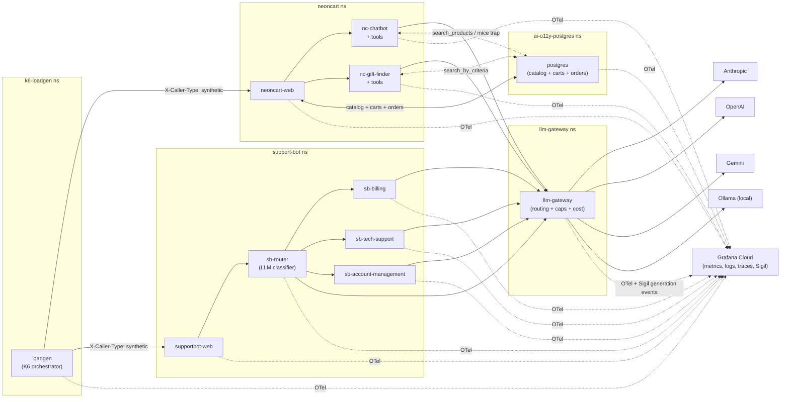

# ai-o11y-demo-apps

> **A real, running AI product stack — instrumented end-to-end — so you can see what AI observability actually looks like.**

Two production-shaped AI applications deploy to any Kubernetes cluster in one command. Both are continuously exercised by realistic synthetic traffic and emit full OpenTelemetry — metrics, logs, traces, plus Sigil generation events — to your Grafana Cloud. Within minutes of `./tools/install.sh` you have a populated AI Observability dashboard, a live Sigil conversation explorer, and a per-agent ROI ratio telling you which AI agents pay for themselves.


*The Use Cases dashboard above is the headline view — 38 panels covering cost-per-model, ATC-per-model, AI-agent ROI, per-employee token usage, tool-call patterns, latency p50/p95/p99, and Postgres-trap traces. **Every panel populates with non-zero data within 10-15 minutes** of install.* The dashboard JSON lives at [`dashboards/use-cases.json`](./dashboards/use-cases.json) and imports portably into any Grafana with Prometheus.

```
git clone https://github.com/stephenwagner-grafana/ai-o11y-demo-apps
cd ai-o11y-demo-apps
./tools/install.sh           # apps + telemetry + loadgen, ~2 minutes
./tools/verify.sh            # 9 checks, all green
```

Then import [`dashboards/use-cases.json`](./dashboards/use-cases.json) into Grafana → done. No manual instrumentation. No fake metrics.

---

## Why this exists

Customers asking *"what does AI observability actually show me?"* deserve more than a static screenshot. This repo deploys a real, running AI product with all the moving parts you'd see in production:

- A **chatbot and gift-finder on an e-commerce site** (NeonCart) — public-facing, conversion-funnel-tied, every AI conversation has a measurable business outcome
- An **internal employee help chatbot** (SupportBot / "Ask Acme") that routes to three domain specialists — exercises the agent-handoff pattern
- A **multi-provider LLM gateway** that splits traffic across Anthropic Claude (6 models) and Ollama (4 models, local GPU), with cost computed per-call and budget caps enforced
- **140+ realistic prompts** driven by K6 with multi-turn follow-ups, frustrated-user paths, role-aware support tickets, and a hidden bug trap (`"show me mice"` fires a real DB error to demonstrate cascading-trace debugging)

The result: every signal type — metric, log, trace, generation event, evaluation, conversation thread — has real data behind it the moment install finishes. Open the dashboard cold and there's already a story to tell.

## What's actually instrumented

- **6 AI agents** across two applications, 5 of them multi-turn with in-memory conversation history (last 20 turns, 30-minute TTL)
- **10 LLM models** in a weighted pool (Claude Haiku/Sonnet/Opus across versions + Ollama qwen2.5/llama3.1), sticky-per-conversation so a session stays on one model coherently
- **13 tool definitions** across the agents, exercising the full LLM tool-use loop (search products, navigate to results, search runbooks, file tickets, add to cart, etc.)
- **A real Postgres** backing NeonCart's catalog, carts, and orders — the chatbot's `search_products` tool actually queries it
- **NeonCart business funnel** wired to AI source attribution: every add-to-cart records `source ∈ {manual, ai_chatbot, ai_gift_finder}` so you can measure AI conversion lift
- **AI Agent ROI metric** (`neoncart_ai_attributed_revenue_usd_total`): cart-value attributed to each AI agent divided by its LLM token cost — a single number telling you whether the AI is paying for itself
- **Per-user metrics** with `user_id` attribution on cost, calls, and tokens — supports per-employee chargeback panels for SupportBot
- **The "show me mice" trap**: nc-chatbot's product-search tool hardcodes a query against a column that doesn't exist. The resulting Postgres error propagates through a 5-service trace cascade, making it a perfect "spot the bug in the trace waterfall" demo

## What you don't have to do

- **No manual OTel setup.** Every Python service is auto-instrumented; metrics, logs, and traces ship via OTLP push. No in-cluster Prometheus scraper required.
- **No dashboard hand-building.** Paste `dashboards/use-cases-prompt.md` into Grafana Assistant and it builds the comprehensive use-case dashboard. Or import JSON via `dashboards/import.sh`.
- **No Cloudflare / DNS / ingress work to demo locally.** `kubectl port-forward` is documented inline; optional Ingress objects ship via chart values for public hostnames.
- **No babysitting once installed.** The loadgen runs continuously, the chart's `pullPolicy: Always` picks up image refreshes, and `tools/verify.sh` exits cleanly when everything's healthy.

## Status

Active development. The full demo cycle (`helm uninstall` → `./tools/install.sh` → `./tools/verify.sh`) has been validated end-to-end and produces ~50 products seeded, all 11 pods healthy, and real LLM traffic flowing within 90 seconds.

---

## Architecture



5 namespaces, ~10 pods. Pods emit OTLP directly to the customer's Grafana Cloud (or via their own Alloy if installed). No in-cluster Prometheus scraper is required — every custom metric (`neoncart_*`, `loadgen_*`) ships via the OTel meter SDK on the same OTLP push pipeline as traces and logs.

---

## Quick start

### Prerequisites

1. **Kubernetes cluster** (k3s, EKS, GKE, kind — anywhere `kubectl` works)
2. **Anthropic Claude API key** (`sk-ant-...`) — the only required provider
3. **Grafana Cloud organization with the Sigil plugin enabled** — Sigil owns canonical pricing and the AI o11y UI
4. **`kubectl` and `helm`** on your PATH
5. **Python 3.10+** and the install-script dependencies:
   ```bash
   pip install -r tools/requirements.txt
   ```
   (in a venv if you prefer: `python3 -m venv .venv && source .venv/bin/activate` first)
6. (Optional) OpenAI / Gemini API keys; Ollama URL for local GPU inference

### Install

```bash
git clone https://github.com/stephenwagner-grafana/ai-o11y-demo-apps
cd ai-o11y-demo-apps

# One-shot: prompts for creds, generates configs, runs helm install
./tools/install.sh

# After install:
./tools/verify.sh    # sanity check that every pod is Running
```

Then port-forward to reach the UIs:

```bash
kubectl -n neoncart    port-forward svc/neoncart-web    8080:8000  # http://localhost:8080
kubectl -n support-bot port-forward svc/supportbot-web 8081:8000  # http://localhost:8081
```

Or set `ingress.enabled=true` (see [Optional Ingress](#optional-ingress) below) to skip port-forwarding.

### Uninstall

```bash
./tools/uninstall.sh   # helm uninstall + optional PVC + namespace cleanup
```

---

## What to look for after install

| Where | What you'll see |
|---|---|
| **NeonCart UI** (`localhost:8080`) | Browse the cyberpunk storefront. Open the **AI Gift Finder** for personalized recommendations or the **chat widget** for product search. Type *"show me mice"* in the chatbot — the AI will pick the `search_products` tool with a `species=mouse` filter, hit Postgres, and surface the column-doesn't-exist error in the trace. |
| **SupportBot UI** (`localhost:8081`) | Ask a billing/IT/account question. The `sb-router` does an LLM classification call, picks a domain, and delegates. The whole flow shows up as a multi-span trace. |
| **Grafana Cloud → AI Observability plugin** | Sigil's Conversations, Generations, Tools, and Analytics panels populate within a minute. Per-model cost breakdowns, eval results (after configuring evaluators), tool-call sequences. |
| **Grafana Cloud → Tempo** | Full traces from browser → web app → specialist → gateway → provider, including the "show me mice" failure cascade. |
| **Grafana Cloud → Prometheus** | All the app-level + AI counters in `docs/METRICS.md` (`neoncart_revenue_usd_total`, `neoncart_ai_attributed_revenue_usd_total`, `gen_ai_client_token_usage_total`, `gen_ai_client_cost_usd_total`, `llm_gateway_provider_open`, etc.). |

---

## Highlighted features

### The "show me mice" trap

Hardcoded into `nc-chatbot`. When the LLM picks the `search_products` tool with a `mice`/`mouse` query, the tool executes a Postgres query against a column that doesn't exist (`species`). The error bubbles through the trace:

```
browser  →  neoncart-web  →  nc-chatbot  →  [tool: search_products]  →  postgres  →  column "species" does not exist
```

This is the signature "tada" moment of the demo. Always on. Type it in the chatbot to see it.

### AI Agent ROI: is the bot paying for itself?

`neoncart-web` emits **`neoncart_ai_attributed_revenue_usd_total`** every time an add-to-cart event fires with `source != "manual"`. The increment is the product's price at time of ATC, and the metric carries `source` (`ai_chatbot`/`ai_gift_finder`) plus `gen_ai_agent_name` (`nc-chatbot`/`nc-gift-finder`) so it joins cleanly against the gateway's per-agent cost counter.

The ROI ratio is just:

```promql
sum by (gen_ai_agent_name) (rate(neoncart_ai_attributed_revenue_usd_total[5m]))
/
sum by (gen_ai_agent_name) (rate(gen_ai_client_cost_usd_total[5m]))
```

Ratio > 1.0 means the agent generated more cart value than it cost in LLM tokens. Source: `apps/neoncart-web/app/metrics.py`.

### Weighted model pools (sticky per conversation)

The LLM gateway randomizes across a configurable pool of models per provider. The shipped Anthropic default mixes six Claude models, biased hard toward cheap/fast Haiku with Opus kept rare (tight rate limits + ~25× the cost of Haiku):

| Model | Weight | Tier |
|---|---|---|
| `claude-haiku-4-5-20251001` | 55% | workhorse |
| `claude-sonnet-4-6` | 23% | latest sonnet |
| `claude-sonnet-4-5` | 12% | older sonnet (label diversity) |
| `claude-opus-4-7` | 5% | latest opus (rare) |
| `claude-opus-4-6` | 3% | older opus (rare) |
| `claude-opus-4-1` | 2% | very rare |

The shipped Ollama default is a 4-model pool spanning the practical
parameter-count range you'd see on a single-GPU box, with one llama3.1
entry mixed into the qwen2.5 family for vendor diversity on the model-name
label. All four are tool-capable.

| Model | Weight | Tier |
|---|---|---|
| `qwen2.5:3b` | 25% | small (~2GB VRAM, fast feedback) |
| `qwen2.5:7b` | 30% | medium (workhorse) |
| `llama3.1:8b` | 25% | medium (different family — vendor diversity) |
| `qwen2.5:14b` | 20% | large (current default) |

> **Heads-up:** the customer's Ollama server must have all four models pulled
> AND configured to keep them resident concurrently. The gateway does not
> auto-pull; a missing model surfaces as a 500. With Ollama's default
> `OLLAMA_MAX_LOADED_MODELS=1` only one model is hot at a time and the other
> three return `"maximum pending requests exceeded"` 503s, which the gateway
> then transparently falls back to Anthropic for — so the "ATC per model"
> dashboard never sees the rotated-out Ollama models. Run this on your
> Ollama host once (idempotent) to fix that:
>
> ```bash
> bash <(curl -sSLk https://raw.githubusercontent.com/stephenwagner-grafana/ai-o11y-demo-apps/main/tools/setup-ollama-host.sh)
> ```
>
> It sets `OLLAMA_HOST=0.0.0.0:11434`, `OLLAMA_MAX_LOADED_MODELS=4`,
> `OLLAMA_NUM_PARALLEL=2`, `OLLAMA_KEEP_ALIVE=30m`, pulls any missing models,
> and warms each one. Needs ~28GB VRAM for the default 4-model pool — adjust
> the `MODELS=` array in the script for smaller GPUs and edit
> `global.modelWeights.ollama` in your values to match.
>
> Avoid `tinyllama`, `llama3.2:1b|3b`, and `gemma2` — they don't support tool
> calling and produce 400s on tool-using prompts.

Override the pool via `ANTHROPIC_MODEL_WEIGHTS` / `OLLAMA_MODEL_WEIGHTS` in your `.env` (picked up by `tools/install.sh`), or edit `global.modelWeights.<provider>` in your values file:

```yaml
global:
  modelWeights:
    # Format: "model_a:weight_a,model_b:weight_b,..." (weights normalized)
    anthropic: "claude-haiku-4-5-20251001:60,claude-sonnet-4-6:35,claude-opus-4-7:5"
    ollama:    "qwen2.5:3b:25,qwen2.5:7b:30,llama3.1:8b:25,qwen2.5:14b:20"
```

### Sticky provider/model routing per conversation

A single `(session_id, conversation_id)` tuple is hashed (MD5, first 4 bytes) to deterministically pick **both** a provider AND a model. Once a conversation starts, every subsequent turn lands on the same provider and model until either ID changes. A new conversation re-rolls. This means:

- Per-conversation dashboard slices stay clean (no model hopping within a thread)
- The same prompt asked in a new conversation will probably hit a different model — exactly the variety you want for the AI o11y story
- Provider stickiness still respects `/open`: if the sticky pick is closed by a budget cap, the gateway falls through to the next open provider

Source: `gateway/app/router.py` (provider sticky) + `gateway/app/providers/*.py` (model sticky).

### Per-conversation chat history

Every multi-turn specialist (`nc-chatbot`, `nc-gift-finder`, `sb-billing`, `sb-tech-support`, `sb-account-management`) keeps the **last 20 turns per `conversation_id` in memory** with a **30-minute TTL**. Without this, "show me cheaper options" right after an SSD recommendation would forget it was talking about SSDs.

This is a single-process in-memory store, fine for the demo at `replicas: 1`; in production you'd back it with Redis or a Postgres conversations table. Source files: `apps/*/app/history.py`.

### Per-provider budget caps + `/open` endpoint

Each provider has a daily budget (Claude defaults to $20/day) or, for Ollama, a GPU utilization threshold. The gateway exposes `GET /open`:

```json
{
  "any_open": true,
  "providers": {
    "anthropic": {"open": true, "spent_usd_today": 5.20, "cap_usd": 20.0},
    "openai":    {"open": false, "reason": "not configured"},
    "ollama":    {"open": true, "gpu_utilization_ratio": 0.42}
  }
}
```

The loadgen polls this every 5s and stops spawning new AI-cohort VUs when Claude is closed — visible as a drop in synthetic traffic on every dashboard.

### Two-tier routing (`X-Caller-Type`)

- **Synthetic traffic** (loadgen sets `X-Caller-Type: synthetic`) → random across configured open providers; respects `/open`; counts against caps
- **Interactive traffic** (no header → real human in a browser) → **always Claude, ungated**

This means a customer demoing the storefront in their browser never gets stuck waiting because loadgen used up Claude's budget — but loadgen still feeds the dashboards 24/7.

### 13 tools across 5 specialists

Specialists ship with proper LLM tool schemas (Anthropic + OpenAI shapes both supported by the gateway):

| Specialist | Tools |
|---|---|
| `nc-chatbot` | `search_products`, `navigate_to_search`, `navigate_to_page`, `get_product_detail`, `add_to_cart` |
| `nc-gift-finder` | `search_by_criteria`, `add_to_cart` |
| `sb-billing` | `lookup_employee_expense`, `submit_reimbursement_request` |
| `sb-tech-support` | `search_runbook`, `create_ticket` |
| `sb-account-management` | `lookup_employee_profile`, `request_password_reset` |

The mice trap lives inside `search_products`. `navigate_to_search` is what the chatbot picks for "show me X" / "take me to Y" intents — it returns a search-results URL rather than performing the query, keeping navigation snappy. All tools call real Postgres queries (where applicable) and emit OTel spans for tool execution.

### Default loadgen behavior

The K6 loadgen runs in the `k6-loadgen` namespace and starts immediately after install. It hits both apps via in-cluster URLs and tags every request with `X-Caller-Type: synthetic` so the gateway can route loadgen traffic across all open providers while keeping browser users always on Anthropic. Full details in [`docs/LOADGEN.md`](./docs/LOADGEN.md); the OOTB shape is:

**Default user pool — 230 users total** (regenerable via `tools/regenerate-users.py --seed N`):

| Cohort | Count | Behavior |
|---|---:|---|
| NeonCart non-AI shoppers | 150 | Browse, search, add-to-cart, checkout — never use chatbot/gift-finder |
| NeonCart gift-finder only | 30 | Always use the gift-finder, never the chatbot |
| NeonCart chatbot only | 15 | Always use the chatbot, never the gift-finder |
| NeonCart both | 5 | Alternate gift-finder + chatbot per session |
| SupportBot (Acme employees) | 30 | 100% use the internal Ask Acme bot |

Cohort assignment is **stable per user** — same user always uses the same feature, so per-user metrics tell a coherent story.

**Default rate: ~3-5 LLM calls/minute total.** Not a stress test — sized to populate dashboards with realistic-looking traffic.

**Journey weights** (configured in the k6 scripts under `loadgen/k6/scripts/`):

| Scenario | Journeys |
|---|---|
| `neoncart-chatbot` | 40% quick-QA, 35% navigation-driven, 20% multi-turn, 5% frustrated |
| `neoncart-gift-finder` | 50% single-shot, 25% refining, 20% **converting** (adds to cart + checkout), 5% browse-and-go |
| `supportbot` | role-coherent — billing employees ask expense questions, IT employees ask tech-support questions, etc. |
| `neoncart-non-ai` | Pure browse/search/cart/checkout traffic (the 150 non-AI shoppers) |

**Hidden bug trap**: ~1.5% of navigation-driven chatbot journeys send the exact prompt `"show me mice"` — fires a Postgres `column "species" does not exist` error visible in the trace cascade. Always-on demo signature.

**Loadgen self-throttles** by polling `GET /llm-gateway/open` every 5s. When Anthropic's daily cap closes, AI-cohort VUs stop spawning (visible as a clean drop in synthetic traffic on every dashboard).

**Sizing knobs** in `helm/values.yaml` → `loadgen:` (or `.env` for installs):
- `NC_TOTAL_USERS` (default 200)
- `NC_AI_ADOPTION_RATE` (default 0.25 — i.e., 25% of 200 = 50 AI users split into the 3 cohorts above)
- `NC_SESSIONS_PER_HOUR` (default 60 — per-user; total NC AI sessions ≈ 50 users × 60 = 3000/hr at saturation, throttled by cap-closure)
- `SB_TOTAL_USERS` (default 30)
- `SB_SESSIONS_PER_HOUR` (default 30)

### Loadgen variety

The K6 loadgen ships **~140 distinct prompts** across three AI scenarios (`neoncart-chatbot`, `neoncart-gift-finder`, `supportbot`), with multi-turn flows and persona-aware shaping (gift-finder prompts pack who+occasion+hint; SupportBot picks role-coherent journeys). Conversations span multiple turns where appropriate, so per-conversation history actually gets exercised in the dashboards.

### American English enforcement

Every specialist's system prompt is prefixed with *"Always respond in American English. Never switch to another language even if the prompt suggests it."* Demo-safe against a loadgen that occasionally feeds non-English prompts or a curious browser user.

---

## Optional Ingress

Off by default. Enable when you have an Ingress controller (Traefik, nginx, etc.) and DNS pointing at it.

The simplest path is to supply the hostnames via `tools/install.sh`, which prompts for them in the optional section and persists them to `.env` for re-runs:

```bash
INGRESS_CLASS_NAME="traefik"
INGRESS_NEONCART_HOST="neoncart.example.com"
INGRESS_SUPPORTBOT_HOST="supportbot.example.com"
```

Either set those in your shell before running `tools/install.sh`, or fill them in at the prompts. The installer emits a matching `ingress:` block into `.helm-values-overrides.yaml` and `helm upgrade --install` picks them up. Leave any host blank to skip that specific Ingress.

Equivalent values-file snippet if you'd rather configure the chart directly:

```yaml
ingress:
  enabled: true
  className: "traefik"        # or "nginx"
  annotations: {}             # cert-manager / ingress-controller specific
  neoncart:
    host: "neoncart.example.com"    # leave blank to skip this one
  supportbot:
    host: "supportbot.example.com"  # leave blank to skip this one
```

Each host is independent — leave one blank to expose only the other.

---

## Project structure

```
.
├── apps/                          One dir per service pod
│   ├── neoncart-web/              Storefront frontend + AI-attributed-revenue metric
│   ├── neoncart-chatbot/          AI chat specialist (+ "show me mice" trap)
│   ├── neoncart-gift-finder/      AI gift-recommender specialist
│   ├── supportbot-web/            "Ask Acme" frontend
│   ├── supportbot-router/         LLM-driven classifier
│   ├── supportbot-billing/        Expense / corp-card specialist
│   ├── supportbot-tech-support/   IT / runbook specialist
│   └── supportbot-account-management/   IAM / profile specialist
├── gateway/                       LLM Gateway (Anthropic + OpenAI + Gemini + Ollama)
├── postgres/                      Postgres init + seed-loader image
├── loadgen/                       Central K6 orchestrator
├── seed/                          Source-of-truth CSVs (products, categories, brands)
├── helm/                          Helm chart that ties it all together
├── tools/                         install.sh / uninstall.sh / verify.sh / regenerate-users.py / make-packages-public.sh
└── docs/                          METRICS.md, LOADGEN.md, SIGIL_INTEGRATION.md
```

Every multi-turn specialist has an `app/history.py` implementing per-conversation memory.

---

## Configuration

The install wizard collects everything; see `docs/SIGIL_INTEGRATION.md` for what each env var does. Key values:

| Required | Purpose |
|---|---|
| `CLAUDE_API_KEY` | Anthropic provider (always required) |
| `SIGIL_ENDPOINT` + `SIGIL_AUTH_TENANT_ID` + `SIGIL_AUTH_TOKEN` | Sigil ingest |
| `OTEL_EXPORTER_OTLP_ENDPOINT` + OTLP instance ID | OTel telemetry → Grafana Cloud |

| Optional | Purpose |
|---|---|
| `OPENAI_API_KEY` / `GEMINI_API_KEY` | Additional cloud providers |
| `OLLAMA_BASE_URL` | Local-GPU provider (e.g. `http://192.168.x.y:11434`) |
| `ANTHROPIC_CAP_USD_PER_DAY` | Default `20` |
| `ANTHROPIC_MODEL_WEIGHTS` / `OLLAMA_MODEL_WEIGHTS` | Weighted model pools |
| `NC_TOTAL_USERS` / `NC_AI_ADOPTION_RATE` / `SB_TOTAL_USERS` | Loadgen sizing |

Full reference: [`helm/values.yaml`](./helm/values.yaml).

### OTel knobs baked into the helper

`helm/templates/_helpers.tpl` injects four OTel env vars into every pod. You don't normally need to override them, but they matter:

| Env var | Value | Why |
|---|---|---|
| `OTEL_EXPORTER_OTLP_PROTOCOL` | `http/protobuf` | We only install the HTTP exporter; default gRPC would crash autoinstrument at startup |
| `OTEL_METRICS_EXEMPLAR_FILTER` | `always_off` | The default `trace_based` filter still emits exemplars on observable-gauge callbacks outside any trace; OTLP/HTTP's proto encoder can't serialize those and throws `EncodingException`, poisoning the whole metric batch |
| `OTEL_LOGS_EXPORTER` | `otlp` | Ships application logs to Loki via the same OTLP pipeline as traces + metrics |
| `OTEL_PYTHON_LOG_CORRELATION` | `true` | Injects `trace_id` / `span_id` into log records for click-through from Logs → Traces |

---

## Metric name notes

A couple of metric names exist because of bugfixes that landed in the past day — call them out if you're building dashboards from scratch:

- **Cost is `gen_ai_client_cost_usd_total`** (lowercase `usd`), not `gen_ai_client_cost_USD_total`. An earlier `unit="USD"` typo got fixed.
- **All `neoncart_*` and `loadgen_*` custom metrics ride OTLP**, not a `/metrics` endpoint. The OTLP-to-Prometheus exporter on the Grafana Cloud side preserves the `_total` suffix on counters.
- The Pydantic `Message` model in the gateway uses `model_config = ConfigDict(extra="allow")` so `tool_call_id` round-trips through to Anthropic. Earlier the field was dropped and Anthropic 400'd with `toolu_unknown` for tool_use linkage.

Full metric catalog: [`docs/METRICS.md`](./docs/METRICS.md).

---

## Documentation

- [`docs/METRICS.md`](./docs/METRICS.md) — every metric, log field, span attribute, label
- [`docs/LOADGEN.md`](./docs/LOADGEN.md) — synthetic user behaviors, journey weights, throttle response
- [`docs/SIGIL_INTEGRATION.md`](./docs/SIGIL_INTEGRATION.md) — Sigil SDK setup, provider wrappers, workflow steps

---

## License

MIT — see [LICENSE](./LICENSE).
